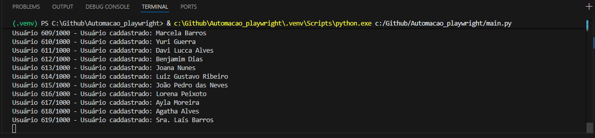
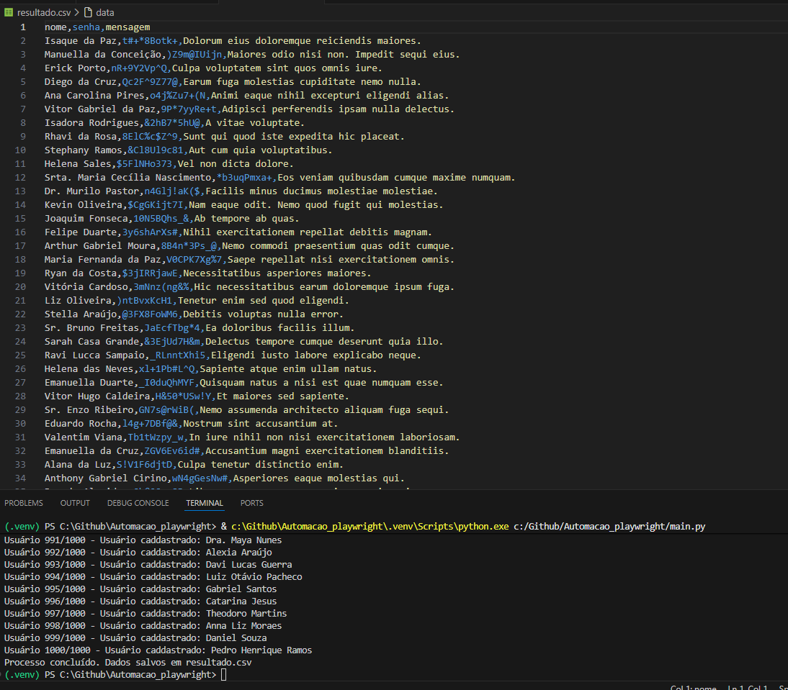

# Automação de Cadastro com Playwright

## Descrição
Projeto de automação desenvolvido em Python utilizando Playwright.
O script gera múltiplos usuários fake com a biblioteca Faker, preenche automaticamente um formulário web de teste e salva os dados gerados em um arquivo CSV.

## Tecnologias Utilizadas
- Python 3
- Playwright
- Faker
- CSV
- Ambiente virtual (.venv)

## Funcionalidades
- Geração automática de dados fictícios
- Preenchimento automatizado de formulário web
- Execução em loop para múltiplos cadastros
- Exibição de progresso no terminal
- Exportação dos dados para arquivo `resultado.csv`

## Como Executar

1. Clone o repositório

2. Crie o ambiente virtual:
python -m venv .venv   

3. Ative o ambiente:
..venv\Scripts\activate

4. Instale as dependências:
pip install -r requirements.txt
playwright install

5. Execute:
python main.py

## Estrutura do Projeto
Automacao_playwright/
│
├── main.py
├── requirements.txt
├── resultado.csv
└── README.md

## Objetivo do Projeto
Praticar automação de formulários, manipulação de dados e organização de projetos Python com ambiente virtual.

## Demonstração

